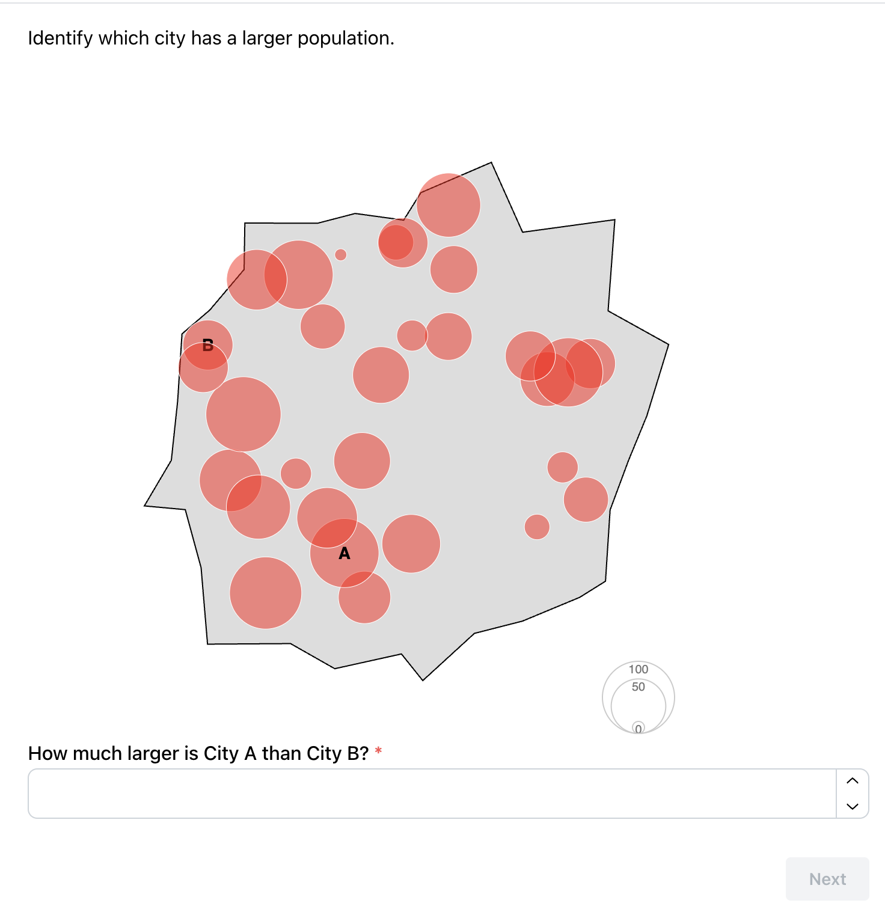
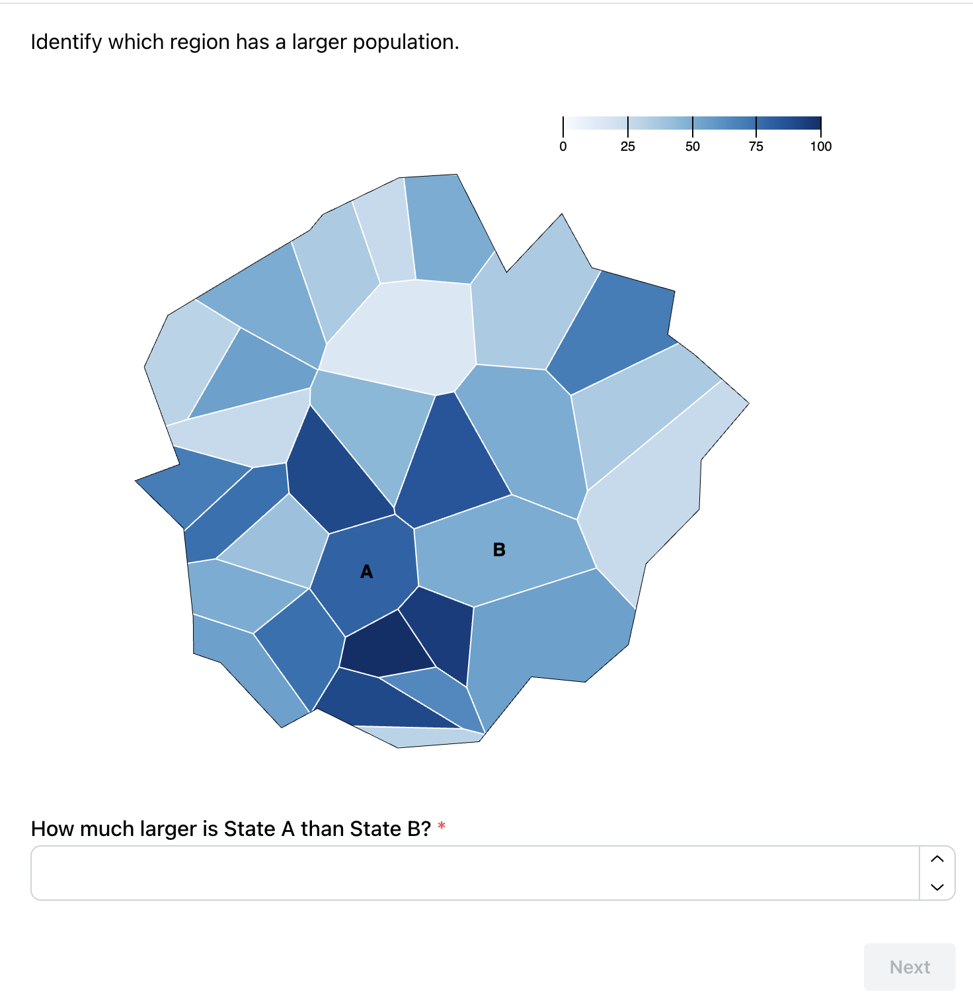
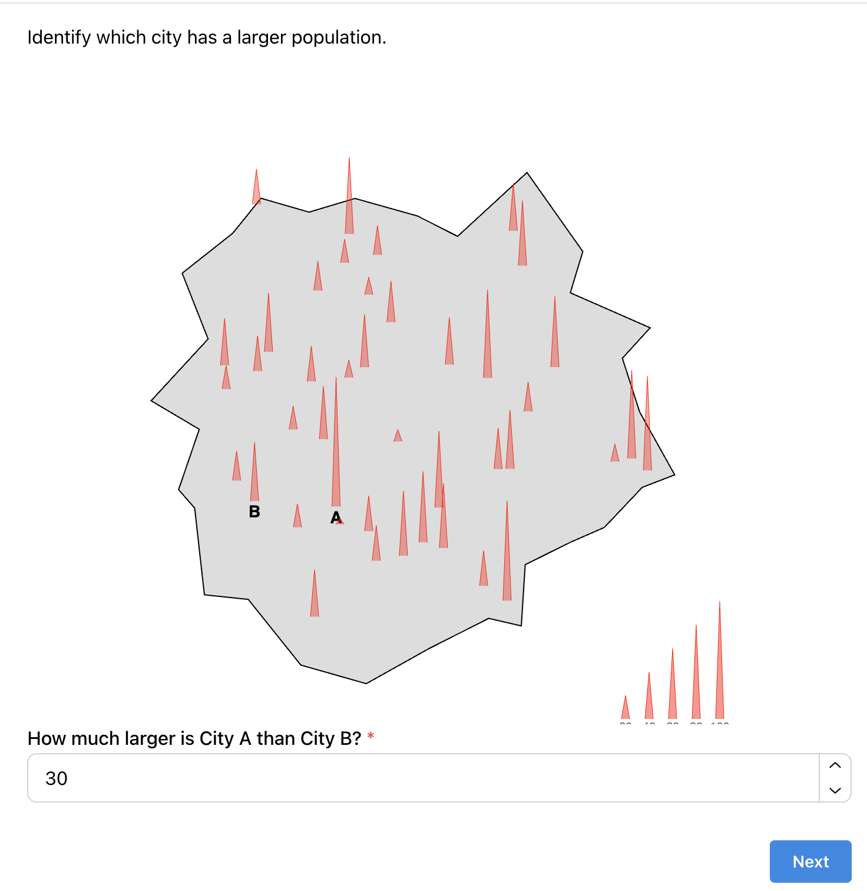
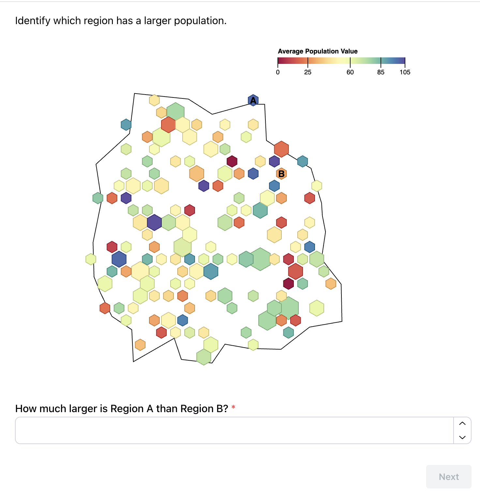
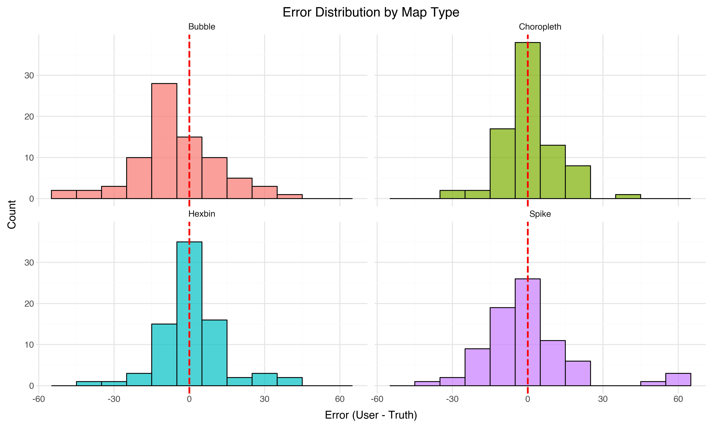
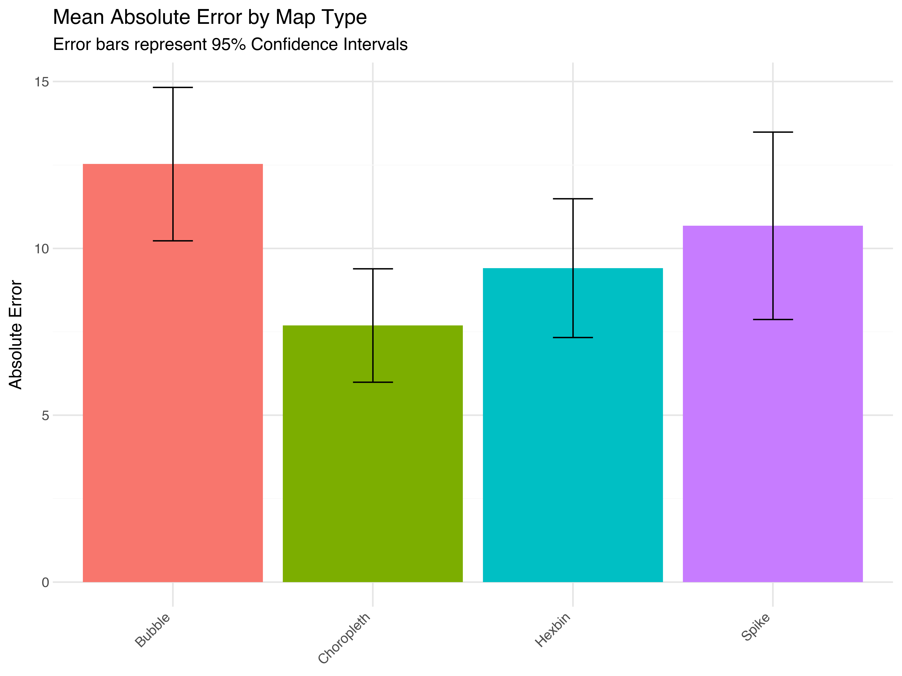
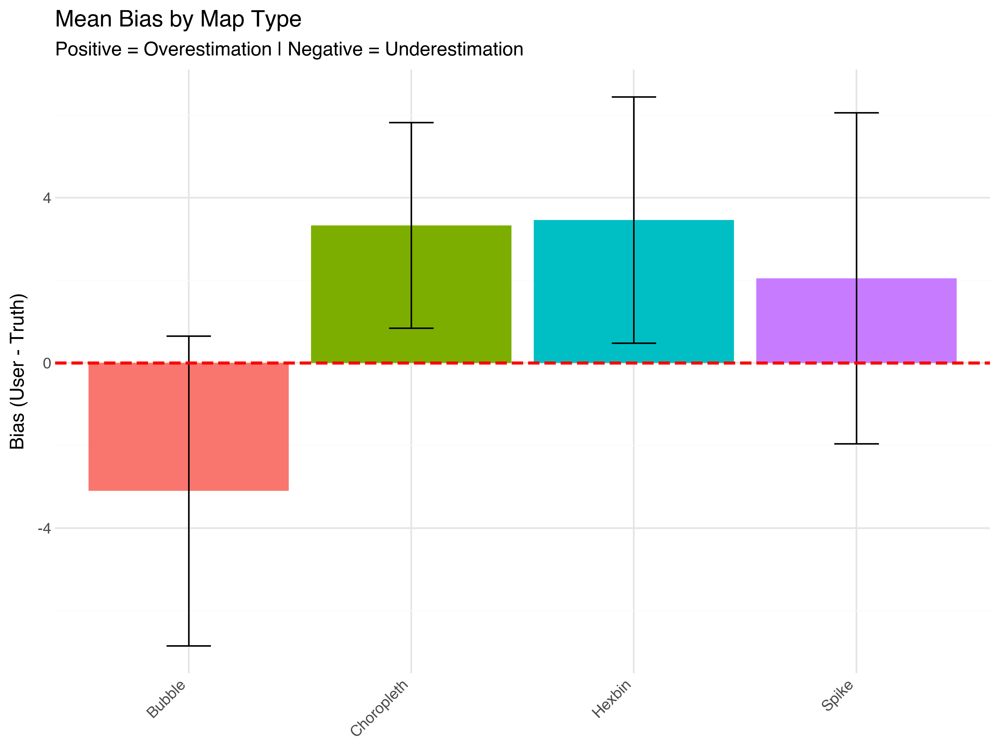

# Assignment 3 - Map Visualization Experiment

**Team Members**: Sarah Meyer and Cole Goulding

## Experiment Link
[**> Click here to view the Live Experiment <**](https://sjessicameyer.github.io/a3-experiment/a3experiment/SEVFVUNGaWFCVEhiMU55ajRqczliUT09)

---

## Experiment Description
Instead of replicating the standard Cleveland and McGill experiment, our team chose to investigate the perceptual effectiveness of different thematic map types.

We designed a controlled user study to compare four different geographical visualization techniques:
1. **Bubble Map**
2. **Choropleth Map**
3. **Spike Map**
4. **Hexbin Map**

### Hypothesis
We hypothesized that cloropleth maps would yield lower estimation errors, followed by bubble maps, spike maps, and finally hex bin maps. 

### The Task
Participants were presented with a map visualization and asked to estimate the population of a specific region or city. We collected 20 trials per participant (5 per map type) to ensure robust data. Trial order was randomized and the even the map shape and data itself was fully randomized. Since hex bin maps are typically multivariate, both size and colors in this case correlated with population. 

### Data Collection
We asked n = 19 friends, family, and classmates to fill out this survey, which we hosted on Github. Participants were asked to use a laptop or desktop computer for the experiment. Participants were allowed to contact us for more clarification. No identifiable information was collected during the experiment.

---

## Visualizations

| Bubble Map | Choropleth Map |
| :---: | :---: |
|  |  |
| **Spike Map** | **Hexbin Map** |
|  |  |

*(Note: Screenshots of the actual experiment interface)*

---
### Data validation
Data was filtered and validated on three criteria:
- A user must fill out all survey questions for their responses to be used
- Error must be reported as a multiple of 5 per survey instructions
- Error cannot be reported as a negative number

### Analysis & Results
We analyzed the results based on two primary metrics:

1. **Absolute Error**: The magnitude of deviation from the actual value.
2. **Bias**: The directional difference indicating tendencies to over- or under-estimate.

### Key Findings
* **Best Performer**: **Choropleth Maps** had the lowest mean absolute error (7.69), followed by Hexbin (9.41), Spike (10.68), and Bubble (12.53).
* **Bias Trends**: **Bubble Maps** were the only visualization where users consistently **underestimated** values (Mean Bias: -3.43). In contrast, users tended to **overestimate** values with Hexbin (+3.41) and Choropleth (+2.97) maps.
* **Statistical Significance**: 
    *   **Absolute Error**: An ANOVA test revealed significant differences between groups (F=3.30, p=0.02). A post-hoc Tukey HSD test confirmed that **Choropleth maps yielded significantly lower error than Bubble maps** (p=0.013).
    *   **Bias**: There was a significant difference in bias (p=0.007). Bubble maps were significantly different from both Choropleth and Hexbin maps, confirming the directional difference in estimation errors.

*This histogram displays trends in the types of errors in estimates by map type with a bin size of 5. The. most notable trend is significant underestimates in the bubble plot.*

*This bar graph shows mean absolute error by map type with 95% confidence intervals. The most significant outcome is that the bubble plot has higher error compared to the choropleth map.*

*This bar graph shows mean bias by map type with 95% confidence intervals. Bias was calculated as User Guess - Actual and represents trends in over or underestimation. Positive bias indicates overestimation while negative represents underestimation. The most significant trend is that bubble plots tend to cause underestimations compared to other map types.*

### Conclusion
In conclusion, our results partially supported our hypothesis. We correctly predicted that Choropleth maps would result in the lowest estimation error, likely due to the ease of comparing color intensity against a legend. However, contrary to our expectation that Bubble maps would be the second best, they actually resulted in the highest error and significant underestimation. This aligns with existing research suggesting that humans struggle to accurately judge area, often scaling by radius instead. Conversely, Hexbin maps performed better than expected (2nd place), suggesting that color-based encoding was more effective than size-based encoding for this specific task. Consequently, we recommend using Choropleth maps for tasks requiring precise value estimation.

---

## Technical Achievements
- **Custom Map Implementation**: Implemented four distinct D3.js map visualizations with fully randomized populations and map polygon shapes.
- **Data Pipeline**: Created a robust analysis pipeline in Python (`analysis.py`) that merges user responses with ground truth data, performs cleaning, and runs statistical tests (ANOVA, Tukey HSD).
- **Automated Visualization**: The analysis script automatically generates error bars and bias distribution plots using `plotnine`.

## Design Achievements
- **Clean UI**: Designed a distraction-free experiment interface to focus participant attention on the map tasks.
- **Color & Scale**: Carefully selected color scales to ensure accessibility and clarity across map and graph types.

---

## References
* [Finding Random Points in a Pologon from ObservableHQ](https://observablehq.com/@essingen123/finding-random-points-in-a-polygon)
* [Stack Overflow](https://stackoverflow.com/a/4492417/31040913)
* [ReVISit] (https://revisit.dev/docs/introduction/)
* [D3.js](https://d3js.org/)
* [Plotnine](https://plotnine.readthedocs.io/)
* [Statsmodels](https://www.statsmodels.org/)
* [Font Awesome](https://fontawesome.com/)
* [Firebase](https://firebase.google.com/)